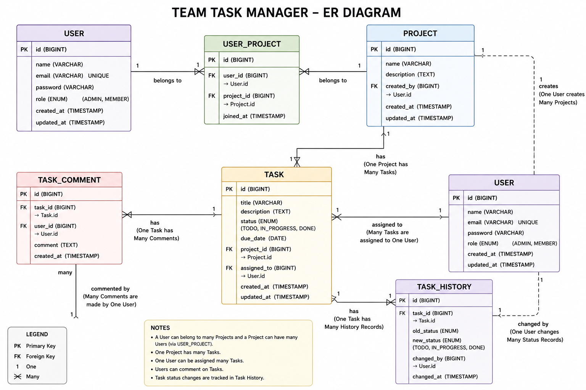
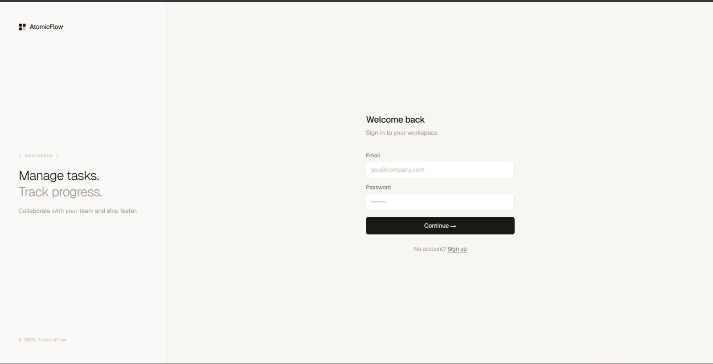
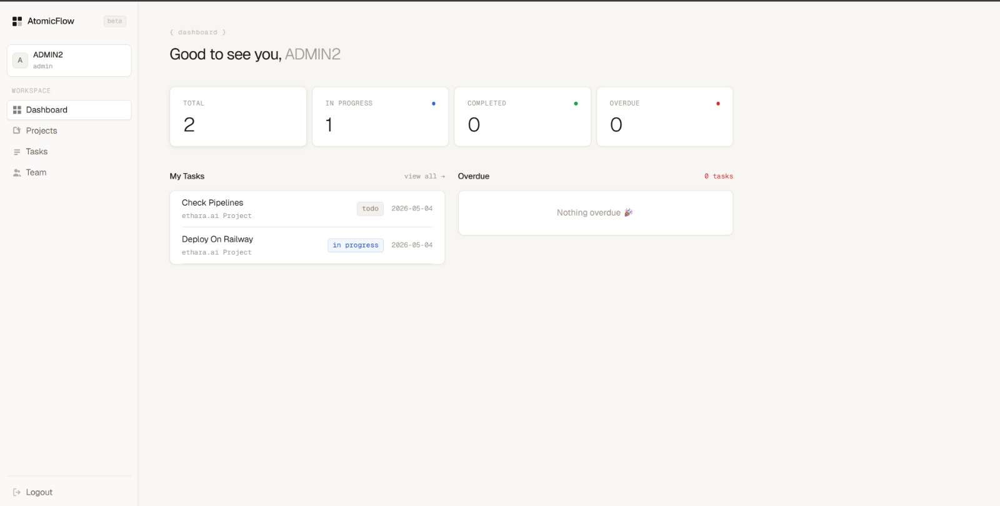
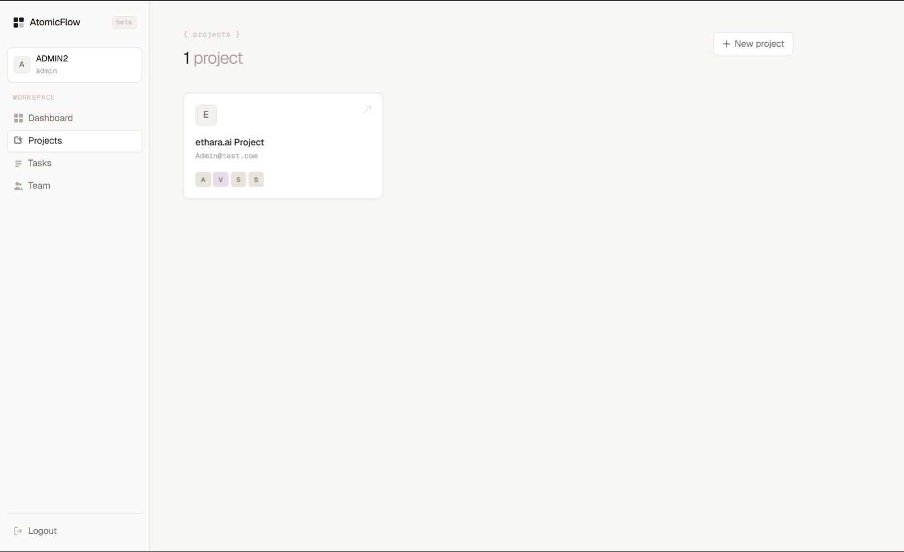
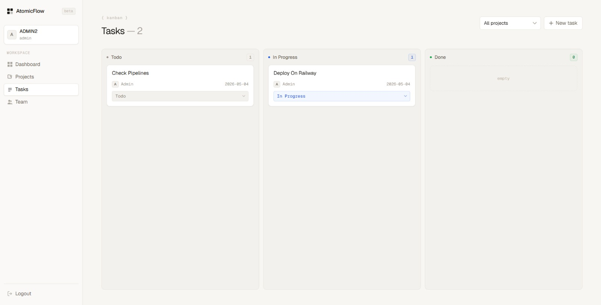
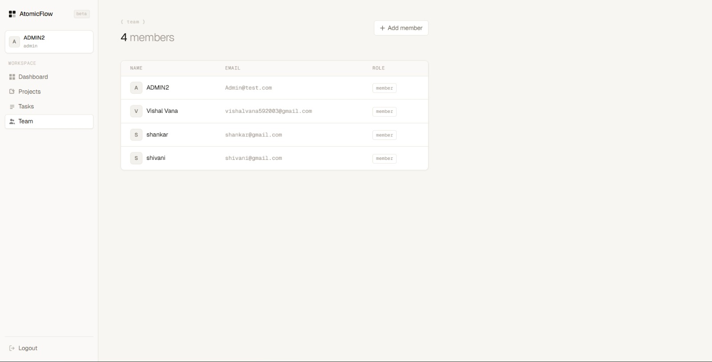

#  AtomicFlow – Team Task Manager

AtomicFlow is a full-stack **Team Task Management System** that allows teams to manage projects, assign tasks, and track progress with role-based access control (Admin/Member).

---

##  Live Demo

🔗 Frontend:
https://atomic-frontend-five.vercel.app/login


🔗 Backend API:
https://atomicflow-production-d2ee.up.railway.app/
---

##  Repositories

* 🔧 Backend: (this repo)
* 🎨 Frontend: https://github.com/vishalvana/atomic-Frontend

---

## ✨ Features

### 🔐 Authentication

* User Signup & Login
* JWT-based authentication
* Secure password hashing (BCrypt)

---

### 👥 Role-Based Access Control

* ADMIN:

  * Create users
  * Create projects
  * Assign members
* MEMBER:

  * View projects
  * Update task status

---

### 📁 Project Management

* Create and manage projects
* Add multiple users to a project
* View project details

---

### 📋 Task Management

* Create tasks
* Assign tasks to users
* Track status:

  * TODO
  * IN_PROGRESS
  * DONE
* Due date tracking

---

### 📊 Dashboard

* Total tasks
* Task status distribution
* Overdue tasks
* Personalized task view

---

## 🛠️ Tech Stack

### Backend

* Java (Spring Boot)
* Spring Security (JWT)
* Spring Data JPA
* PostgreSQL
* Railway (Deployment)

---

### Frontend

* React (Vite)
* Tailwind CSS
* Axios
* React Router

---

## 🧠 System Design

### ER Diagram



---

### Architecture

* RESTful APIs
* Layered architecture (Controller → Service → Repository)
* DTO-based response handling

---

## 📸 Screenshots

### 🔐 Login Page



---

### 📊 Dashboard



---

### 📁 Projects



---

### 📋 Task Board (Kanban)



---

### 👥 Users Management (Admin)



---

## 🔌 API Endpoints

### Auth

* `POST /auth/signup`
* `POST /auth/login`
* `GET /auth/me`

---

### Users

* `GET /users`
* `POST /users` (ADMIN only)

---

### Projects

* `GET /projects`
* `POST /projects` (ADMIN only)

---

### Tasks

* `POST /tasks`
* `GET /tasks/user/{userId}`
* `GET /tasks/project/{projectId}`
* `PUT /tasks/{taskId}/status`

---

### Dashboard

* `GET /dashboard`

---

## ⚙️ Setup Instructions

### Backend

```bash
git clone <backend-repo>
cd AtomicFlow
```

Configure database in `application.properties`

```properties
spring.datasource.url=jdbc:postgresql://localhost:5432/task_manager
spring.datasource.username=your_username
spring.datasource.password=your_password
```

Run:

```bash
mvn spring-boot:run
```

---

### Frontend

```bash
git clone https://github.com/vishalvana/atomic-Frontend
cd atomic-Frontend
npm install
npm run dev
```

---

## 🔐 Default Admin Credentials

```text
Email: Admin@test.com
Password: Admin123
```

---

## 🚀 Deployment

* Backend: Railway
* Frontend: Railway

---

## 🧪 Testing

* Tested using Postman
* JWT-based authorization

---

## 💡 Future Improvements

* Drag & Drop Kanban
* Notifications
* File attachments
* Activity logs
* Pagination & filtering

---

## 👨‍💻 Author

**Vishal Vana**

---

## ⭐ If you like this project

Give it a star ⭐ on GitHub!
